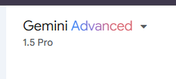
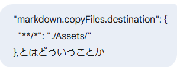

# 2025/01/03

```json
{
  "editor.unicodeHighlight.nonBasicASCII": false,
  "editor.defaultFormatter": "esbenp.prettier-vscode",
  "tabnine.experimentalAutoImports": true,
  "workbench.iconTheme": "material-icon-theme",
  "workbench.colorCustomizations": {
    "terminal.background": "#00000000"
  },
  "workbench.settings.applyToAllProfiles": ["workbench.colorCustomizations"],
  "git.autofetch": true,
  "workbench.editorAssociations": {
    "{git,gitlens}:/**/*.{md,csv,svg}": "default"
  },
  "markdown.extension.print.imgToBase64": true,
  "markdown.extension.print.absoluteImgPath": false,
  "vsnotes.defaultNotePath": "c:\\WORK\\01.Memo\\1\\VSNotes",
  "workbench.colorTheme": "One Dark Pro Flat",
  "accessibility.signalOptions.volume": 0,
  "markdown.marp.themes": [
    "",
    "C:\\WORK\\01.Memo\\1\\anything\\themas\\test.css",
    "1\\anything\\themas\\test.css"
  ],
  "liveServer.settings.donotShowInfoMsg": true,
  "workbench.activityBar.location": "top",
  "markdown.copyFiles.destination": {
    "**/*": "./Assets/"
  },
  "editor.formatOnSave": true
}
```

## 記事

````text
## VSCode標準機能でMarkdown画像をAssetsフォルダに自動保存！

VSCodeでMarkdownを記述する際、画像を貼り付けると自動で画像ファイルを保存してくれる便利な機能をご存知ですか？

この機能を活用すれば、画像ファイルの管理が楽になり、Markdownの可読性も向上します。

この記事では、VSCodeの標準機能で、Markdownに画像をコピペする際にAssetsフォルダに自動保存する設定方法を解説します。

### 設定方法

1. **VSCodeの設定画面を開く**

   - Windows/Linux: `File` > `Preferences` > `Settings`
   - macOS: `Code` > `Settings` > `Settings`

2. **設定画面から `settings.json` を開く**

   - 設定画面右上の `Open Settings (JSON)` アイコンをクリックします。
   [Image of Open Settings (JSON) icon in VS Code]


3. **`settings.json` を編集**

   - `settings.json` ファイルが開きますので、 `"markdown.copyFiles.destination"` の設定を追加・変更します。
   - 以下の設定を追記してください。

     ```json
     "markdown.copyFiles.destination": {
       "**/*": "${currentFileDir}/Assets/${basename}"
     },
     ```

     - `"**/*"` : すべてのMarkdownファイルに適用することを意味します。
     - `${currentFileDir}` は、現在編集中のMarkdownファイルがあるディレクトリを表します。
     - `/Assets/` は、画像を保存するフォルダ名です。この設定で、Markdownファイルと同じディレクトリに "Assets" フォルダが自動作成されます。
     - `${basename}` は、コピーした画像のファイル名（拡張子を含む）を表します。


4. **設定を保存**

   - `settings.json` ファイルを保存します。


これで、Markdownファイルに画像をコピペすると、自動的に "Assets" フォルダが作成され、その中に画像が保存されるようになります。

### 設定画面を開く他の方法

設定画面を開くには、以下の方法もあります。

* **コマンドパレットから開く**
   - `Ctrl + Shift + P` (Windows/Linux) または `Cmd + Shift + P` (macOS) を押してコマンドパレットを開きます。
   - `Preferences: Open Settings (JSON)` と入力して `Enter` を押します。
* **ショートカットキー**
   - `Ctrl + ,` (Windows/Linux) または `Cmd + ,` (macOS) を押します。


### 補足

- `markdown.copyFiles.destination` には、様々な変数を用いて保存先をカスタマイズできます。
- 上記の設定は、VSCodeのバージョン1.79以降で利用可能です。


**この設定を活用して、Markdownでの画像管理を効率化しましょう！**

````



## 表・テーブル

| テスト | テスト | テスト | テスト | テスト |
| ------ | ------ | ------ | ------ | ------ |
| 1      | 2      | 3      | 4      | 5      |
| 6      | 7      | 8      | 9      | 10     |
| 11     | 12     | 13     | 14     | 15     |
| 16     | 17     | 18     | 19     | 20     |
| 21     | 22     | 23     | 24     | 25     |
| 26     | 27     | 28     | 29     | 30     |

## 記事 2

````text
## VSCodeの標準機能でMarkdownに画像を貼り付ける方法

VSCodeでMarkdownを編集する際、画像を挿入したい場面は多いですよね。以前は拡張機能が必要でしたが、バージョン1.79以降、標準機能で画像を貼り付けられるようになりました。

この記事では、設定ファイル `settings.json` を使って画像の保存先を指定する方法を紹介します。

### 設定方法

1. **`settings.json` を開く**

   `settings.json`を開くには、以下の3つの方法があります。

   - **方法1: GUIで開く**
     - `Ctrl + ,` (Windows/Linux) または `Cmd + ,` (macOS) を押して設定画面を開きます。
     - 右上の **「JSONを開く」** アイコンをクリックします。

     [Image of VSCodeのsetting.jsonを開く]

   - **方法2: コマンドパレットから開く**
     - `Ctrl + Shift + P` (Windows/Linux) または `Cmd + Shift + P` (macOS) を押してコマンドパレットを開きます。
     - `Open Settings (JSON)` と入力してEnterキーを押します。

   - **方法3: ショートカットキーで開く**
     - `Ctrl + K Ctrl + S` (Windows/Linux) または `Cmd + K Cmd + S` (macOS) を押します。

2. **`markdown.copyFiles.destination` を設定する**

   - `settings.json` に以下の設定を追加します。

     ```json
     "markdown.copyFiles.destination": {
         "**/*": "./Assets/"
     }
     ```

   - この設定により、Markdownファイルと同じディレクトリに `Assets` フォルダが作成され、そこに画像が保存されます。
   - 必要に応じて `./Assets/` の部分を変更して、画像の保存先をカスタマイズできます。

   [Image of VSCodeのsetting.jsonにmarkdown.copyFiles.destinationを設定する]

3. **画像を貼り付ける**

   - 画像をコピーし、Markdownファイルの貼り付けたい場所にカーソルを合わせて `Ctrl + V` (Windows/Linux) または `Cmd + V` (macOS) を押します。
   - 画像が `Assets` フォルダに保存され、Markdownファイルには画像への相対パスが自動的に挿入されます。

### 注意点

- この機能はVSCode 1.79以降で利用可能です。古いバージョンをお使いの場合は、VSCodeをアップデートしてください。
- 画像のファイル名は自動的に生成されます。ファイル名を変更したい場合は、`Assets` フォルダ内で手動で変更してください。


これで、VSCodeの標準機能で簡単にMarkdownに画像を貼り付けることができます。ぜひ活用してみてください。
````



## 記事 3

## VS Code で画像をコピペ！設定ひとつで楽々画像管理

Visual Studio Code（VS Code）で Markdown ファイルを編集する際、画像を貼り付ける作業は頻繁に発生しますよね？

いちいち画像を保存して、パスを指定して… と面倒な手順を踏んでいませんか？

実は VS Code には、**画像をコピー＆ペーストするだけで自動的に指定フォルダに保存してくれる**便利な機能が備わっています。

設定方法はいくつかありますので、ご自身に合った方法を選んで設定してみてください。

### 設定方法 1：GUI で設定

1. **設定を開く**

   VS Code の左下にある歯車アイコンをクリックし、「設定(Settings)」を開きます。

   [Image of VS Code settings icon]

2. **Markdown の設定を探す**

   設定画面上部の検索バーに `"markdown.copyFiles.destination"` と入力します。

   [Image of VS Code settings search bar]

3. **設定値を追加**

   `markdown.copyFiles.destination` の項目に、以下の設定を追加します。

   ```json
   "markdown.copyFiles.destination": {
     "**/*": "./Assets/"
   },
   ```

   この設定により、**全ての Markdown ファイルにおいて、画像をコピー＆ペーストすると、`Assets`フォルダに画像が保存されます。**

   [Image of VS Code settings with markdown.copyFiles.destination]

### 設定方法 2：settings.json を直接編集

1. **設定を開く**

   VS Code の左下にある歯車アイコンをクリックし、「設定(Settings)」を開きます。

   [Image of VS Code settings icon]

2. **`settings.json`を開く**

   設定画面上部のタブで「JSON」を選択します。

   [Image of VS Code settings JSON tab]

3. **Markdown の設定を探す**

   `settings.json` ファイル内で `"markdown.copyFiles.destination"` を探します。 既に設定がある場合は、その部分を編集します。

4. **設定値を追加**

   `"markdown.copyFiles.destination"` の項目に、以下の設定を追加します。

   ```json
   "markdown.copyFiles.destination": {
     "**/*": "./Assets/"
   },
   ```

   この設定により、**全ての Markdown ファイルにおいて、画像をコピー＆ペーストすると、`Assets`フォルダに画像が保存されます。**

### 設定方法 3：コマンドパレットから設定

1. **コマンドパレットを開く**

   `Ctrl + Shift + P` (Windows/Linux) または `Cmd + Shift + P` (macOS) を押してコマンドパレットを開きます。

2. **設定を開く**

   コマンドパレットに `Preferences: Open Settings (JSON)` と入力して Enter キーを押します。

3. **Markdown の設定を探す**

   `settings.json` ファイル内で `"markdown.copyFiles.destination"` を探します。 既に設定がある場合は、その部分を編集します。

4. **設定値を追加**

   `"markdown.copyFiles.destination"` の項目に、以下の設定を追加します。

   ```json
   "markdown.copyFiles.destination": {
     "**/*": "./Assets/"
   },
   ```

   この設定により、**全ての Markdown ファイルにおいて、画像をコピー＆ペーストすると、`Assets`フォルダに画像が保存されます。**

### 使い方

設定が完了したら、あとは画像をコピーして Markdown ファイルに貼り付けるだけです。

1. **画像をコピー**

   任意の画像をコピーします。

2. **Markdown ファイルに貼り付け**

   VS Code で編集中の Markdown ファイルに、コピーした画像を貼り付けます。

すると、`Assets`フォルダに画像が自動的に保存され、Markdown ファイルには画像へのパスが記述されます。

### まとめ

この設定により、画像の管理が劇的に楽になります。

- 画像を保存する手間が省ける
- パスの記述ミスを防げる
- Markdown ファイルの可読性が向上する

ぜひこの機能を活用して、快適な Markdown 編集を実現しましょう！
