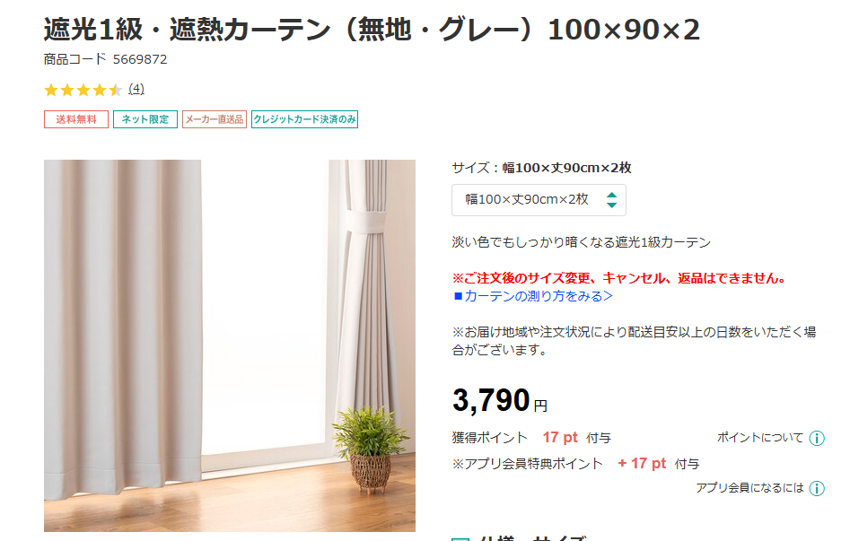
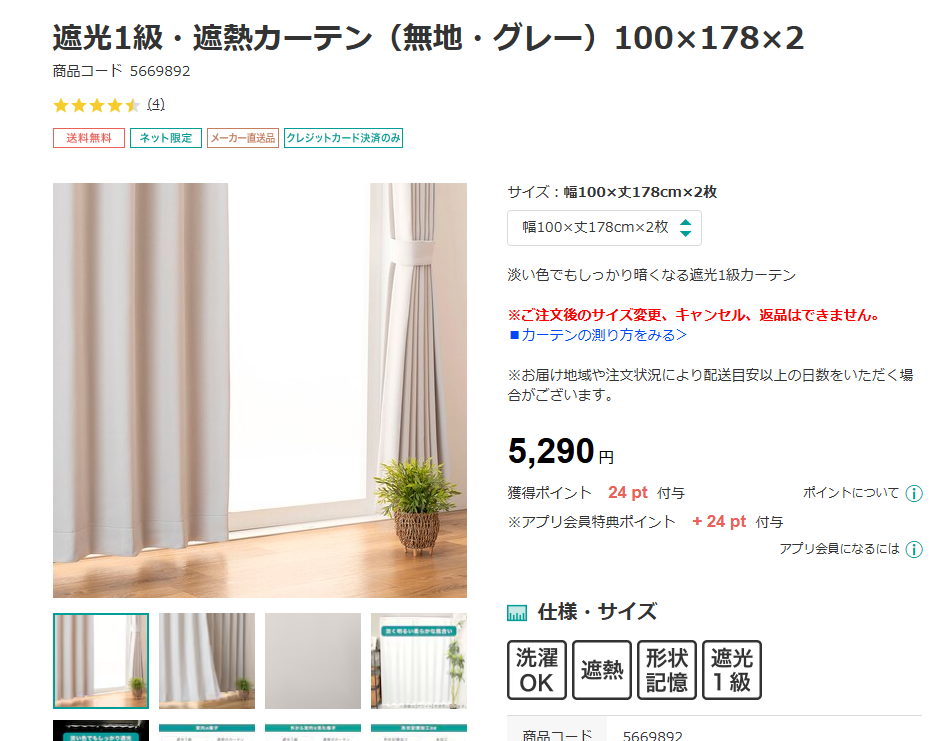
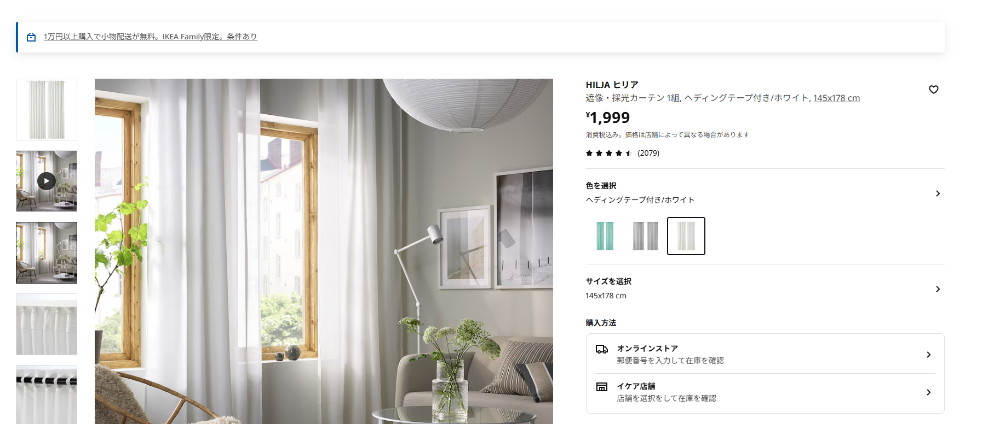
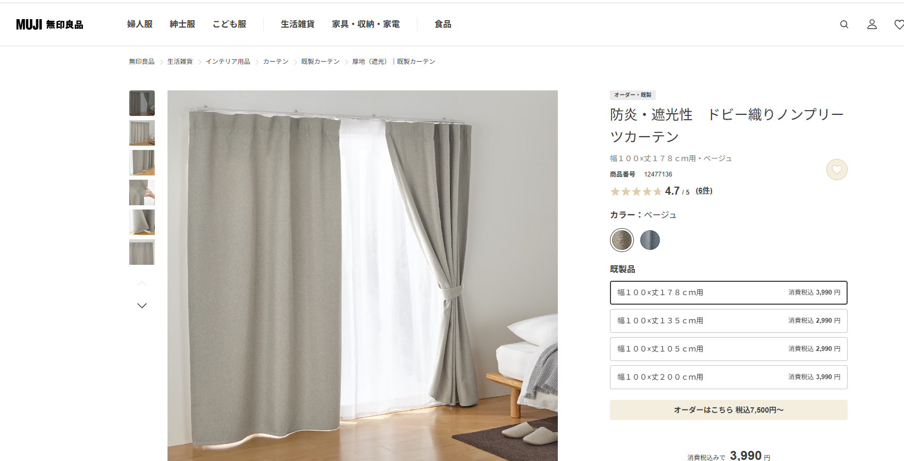
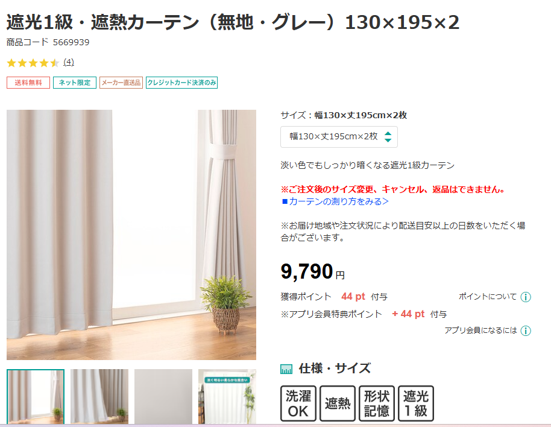
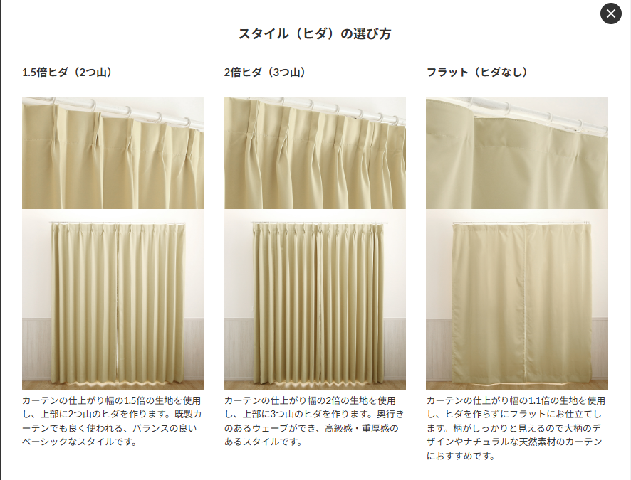

# カーテン

## 前提

- 146x180（ヨコ ✕ タテ）洋室
- 115x95（ヨコ ✕ タテ）和室
- 180x90（ヨコ ✕ タテ）和室

## 候補

- https://www.nitori-net.jp/ec/product/5669867s/

## サイズ検討

### 180x90（ヨコ ✕ タテ）洋室

### 146x180（ヨコ ✕ タテ）和室

https://www.ikea.com/jp/ja/p/hilja-curtains-1-pair-with-heading-tape-white-90509428/  

　→レースのカーテン

https://www.muji.com/jp/ja/store/cmdty/detail/4550512477136

### 115x95（ヨコ ✕ タテ）和室

## 他の候補

- https://www.perfect-space.jp/c/can/syakou_tokusyu/ps_brilliant

### Tips

- フラットとは

  