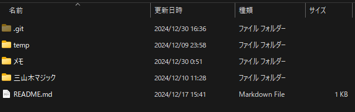

# 2025_Memo

2025年のメモのリポジトリ

## テキストルール

■：Markdownでいうところの、##

▽：注意

★：重要

◎：###

●：####

♦：#####

#：タイトル  
　→ファイル名とタイトルは合わせる

## フォルダ構成

- temp

- プロジェクトごとにフォルダを作成する。
  - 何の目的もないメモは、tempにすればいい。でも、ほとんどの場合は、目的がある。
  - そのときは、ChatGPTへの指示などもプロジェクトごとにしたい。
    - よく使うフォルダなどを作成して、その下に概要欄や、AIへの指示など作成する。
  - Markdownなどで、画像を貼り付ける場合は、assetフォルダを作成して画像を管理する。
    - 例：こんな感じ

- 前年度のメモフォルダを丸ごとコピーするなどはしない。

## 扱うファイルの種類

- テキストやMarkdown
- ExcelやPDFなどのバイナリファイルについては、GoogleDriveで管理する。
  - GoogleDriveも年によって、管理を分ける。
  - 不要な容量を削除しやすくするため。

## 扱う情報

- 公開できる情報のみ
- URLで共有できるのが便利だから、公開リポジトリにしてあるから。

## ツール

- Markdownを扱うとき、Typora
