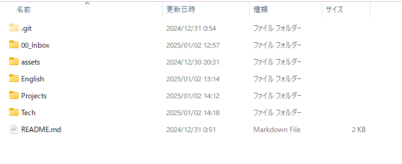
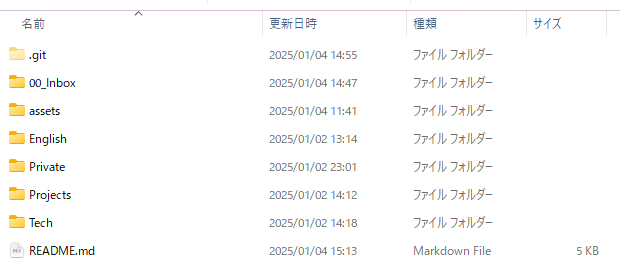

# 2025_Memo

2025 年のメモのリポジトリ

- [2025_Memo](#2025_memo)
  - [テキストルール](#テキストルール)
  - [フォルダ構成](#フォルダ構成)
  - [扱うファイルの種類](#扱うファイルの種類)
  - [扱う情報](#扱う情報)
  - [ツール](#ツール)
  - [画像コピペ設定](#画像コピペ設定)
  - [フォルダ名](#フォルダ名)
  - [Markdown とテキストファイルの使い分け](#markdown-とテキストファイルの使い分け)
    - [Markdown](#markdown)
    - [テキストファイル](#テキストファイル)

## テキストルール

■：Markdown でいうところの、##

▽：注意

★：重要

◎：###

●：####

♦：#####

#：タイトル  
　 → ファイル名とタイトルは合わせる

## フォルダ構成

- 00_Inbox には、一時ファイルや雑記などもここにする。

- プロジェクトごとにフォルダを作成する。

  - 何の目的もないメモは、00_Inbox にすればいい。でも、ほとんどの場合は、目的がある。

    - 雑記する場合は、日付のファイルを作っておく。
    - 一旦そこで書いて、どこかのフォルダに分類してファイルを作成する。

  - そのときは、ChatGPT への指示などもプロジェクトごとにしたい。

    - よく使うフォルダやテンプレートなどを作成して、その下に概要欄や、AI への指示など作成する。

  - Markdown などで、画像を貼り付ける場合は、asset フォルダを作成して画像を管理する。

    - 例：こんな感じ

      

- 前年度のメモフォルダを丸ごとコピーするなどはしない。

- 必要なときに、その前年度のものに戻って、必要な文だけコピーする。

- テンプレートファイルは、最新ものだけ残して、それ以外は old フォルダに日付を付けていれる。

## 扱うファイルの種類

- テキストや Markdown
- Excel や PDF などのバイナリファイルについては、GoogleDrive で管理する。
  - GoogleDrive も年によって、管理を分ける。
  - 不要な容量を削除しやすくするため。

## 扱う情報

- 公開できる情報のみ
- URL で共有できるのが便利だから、公開リポジトリにしてあるから。

## ツール

- Markdown を扱うとき、Typora
  - 結局、VSCode がいいかも。
  - WYSIWYG である必要がない。
  - 画像を貼り付けると、WYSIWYG だと見づらい。
  - リンクの貼り付けも VSCode のほうが便利。
  - VSCode が有能過ぎて、拡張機能を使えばできないことがない。
  - WYSIWYG にこだわるなら、Typora かな。
  - リンクの例
    - プレーンテキストの場合：
      - https://qiita.com/Miki-90/items/c7338d4839867609e991
    - Markdown のリンクの場合：
      - [押せる](https://qiita.com/Miki-90/items/c7338d4839867609e991)
- Text を扱うとき、サクラエディタ

## 画像コピペ設定

```json
  "markdown.copyFiles.destination": {
    "**/*": "./assets/"
  }
```

はじめは、この設定を使っていたが、Typora で`./assets`に画像を保存するように設定していた。VSCode で、`./Assets`で保存するようにしていた。  
でも、windows ではフォルダの大文字小文字を区別しないが、GitHub では大文字と小文字を区別するため、画像が正しく表示されなかった。  
なので、assets に統一する。images よりも、assets のほうがいい理由は、a なので一番上に来る。また、小文字なのは、他のメインで使っているフォルダとは違うから。

## フォルダ名

- 1 番上の階層のフォルダは英語にする。
- 最初の文字は基本は大文字で、それ以外は小文字にする。
  - 次の PC を買ったときの初期設定もそうする。
  - 例えば、Work などのように。
- ここらへんも、使いながら最適解を見つけていきたい。
  - もっと良いものがあれば取り入れていきたい。



## Markdown とテキストファイルの使い分け

### Markdown

- 構造化したいとき

### テキストファイル

- 自由に書き出したいとき
- アイデアを練るとき
- スピード重視
